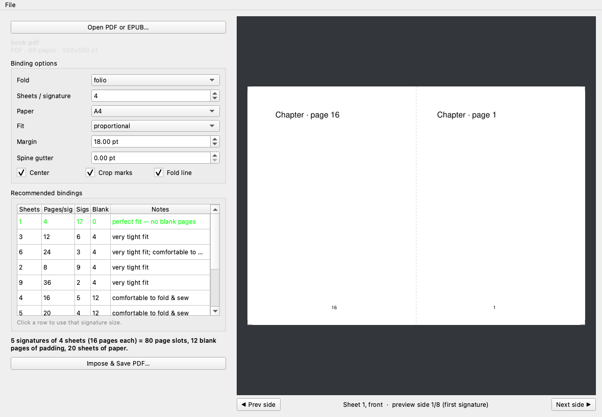

# MyBinder

A macOS desktop app for **imposition** — rearranging the pages of a book so
that when you print, fold, and sew them, they come out in the right order. It
reads **PDF and EPUB**, recommends sensible signature layouts for your page
count, and exports a print-ready PDF.

Inspired by the excellent [bookbinder-js](https://github.com/momijizukamori/bookbinder-js),
rebuilt natively in Python.



## What it does

- **Reads PDF and EPUB** (plus MOBI, FB2, CBZ). Reflowable formats like EPUB are
  paginated to a fixed page size and baked to PDF before imposition.
- **Recommended bindings.** Give it a 68-page document and it shows you, at a
  glance, every reasonable way to bind it:

  | Sheets/sig | Pages/sig | Signatures | Blank pages | Notes |
  |-----------:|----------:|-----------:|------------:|-------|
  | 1 | 4 | 17 | 0 | perfect fit — no blank pages |
  | 4 | 16 | 5 | 12 | comfortable to fold & sew |
  | 5 | 20 | 4 | 12 | comfortable to fold & sew |

  …so you can trade off padding waste against how thick (and foldable) each
  signature is.

- **Folio imposition** — the standard 2-up booklet/signature layout that covers
  saddle-stitch booklets and multi-signature sewn books.
- **Configurable:** paper size (A4/A3/A5/Letter/Legal/Tabloid), sheets per
  signature, proportional vs. snug fit, page centering, outer margins, spine
  gutter, crop marks, and a dotted fold line.
- **Live preview** — page through the imposed sheets (front/back of each sheet)
  before you commit.

## Terminology, briefly

| Term | Meaning |
|------|---------|
| **Sheet** | One physical piece of paper through the printer. |
| **Fold** | How many times a sheet is folded. Folio = 1 fold = 4 pages/sheet. |
| **Leaf** | One half of a folded sheet; a page on each side. |
| **Signature** | A bundle of sheets nested and folded together as a unit. |

A book is bound by sewing or gluing several signatures in sequence. Folio
signatures hold `4 × sheets-per-signature` pages.

## Install & run

Requires Python 3.11+ (tested on 3.14) and macOS.

```bash
git clone https://github.com/ruxpi/MyBinder.git
cd MyBinder
./scripts/run.sh        # creates the venv on first run, then launches the app
```

Or manually:

```bash
python3 -m venv .venv
.venv/bin/pip install -r requirements.txt
.venv/bin/python mybinder.py
```

## Command line

Everything the GUI does is also scriptable:

```bash
# See recommended signature sizes for a document
python -m bookbinder recommend book.pdf

# Impose into a print-ready PDF
python -m bookbinder impose book.epub -o out.pdf --sheets 4 --paper A4
```

`impose` flags: `--sheets`, `--fold {folio,quarto,octavo}`, `--paper`,
`--fit {proportional,snug}`, `--margin`, `--gutter`, `--no-center`,
`--no-crop`, `--no-fold-line`.

## Build a standalone .app

```bash
.venv/bin/pip install py2app
.venv/bin/python setup.py py2app
# → dist/MyBinder.app
```

## How to print & fold

1. Open your PDF or EPUB and pick a signature size from the recommendations.
2. Export the imposed PDF.
3. Print **double-sided, flip on the short edge** (the sheets are landscape).
4. For each signature, stack its sheets in order, fold the stack in half along
   the dotted line, and nest them.
5. Sew or staple along the fold, then bind the signatures together.

## Project layout

```
bookbinder/      core library (no GUI dependency)
  layout.py      signature math + recommendation engine
  document.py    PDF/EPUB loading via PyMuPDF
  impose.py      imposition engine
  cli.py         command-line interface
app/             PySide6 desktop GUI
tests/           pytest suite for the math + imposition
```

## Running the tests

```bash
.venv/bin/pip install pytest
.venv/bin/python -m pytest -q
```

## License

MIT — see [LICENSE](LICENSE).
